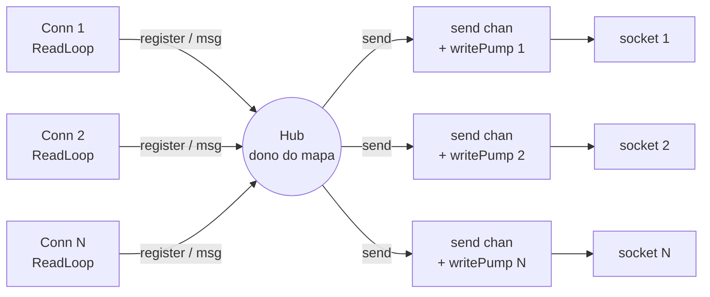

# Real-Time Chat — Hub / Broker Pattern em Go

Um servidor de chat WebSocket construído como exercício de **concorrência idiomática em Go**. O foco não é o WebSocket em si (o [`gws`](https://github.com/lxzan/gws) cuida de handshake e framing), e sim o problema de fundo:

> Como múltiplas goroutines — uma por conexão — escrevem para um conjunto compartilhado de clientes **sem corromper estado, sem locks espalhados, e sem que um cliente lento derrube os outros**?

A resposta é o **Hub pattern**: uma única goroutine é dona do estado compartilhado, e todo mundo conversa com ela por channels.

## Conceitos de Go praticados

- Hub/Broker pattern (estado compartilhado com dono único)
- Fan-out de mensagens via channels
- Isolação de backpressure com channel de saída por conexão
- Posse de buffer e cópia antes de cruzar fronteira de goroutine
- Encerramento gracioso com o idiom `quit`/`done`
- Propagação de sinal de SO com `signal.NotifyContext`
- Prevenção de goroutine leaks

## Arquitetura

Três tipos de goroutine rodam ao mesmo tempo:

1. **Goroutines de leitura** — uma por conexão (`socket.ReadLoop()` do `gws`). Recebem frames e disparam os eventos `OnOpen` / `OnMessage` / `OnClose`.
2. **A goroutine do Hub** — uma só no processo inteiro. É a **dona** do mapa de clientes; ninguém mais toca nele.
3. **A goroutine principal** — o `http.Server`, que aceita novas conexões.

As goroutines de leitura nunca mexem no mapa diretamente: elas mandam recados ao Hub pelos channels `register`, `unregister` e `broadcast`. Como só o Hub lê e escreve no mapa, **não há corrida de dados — e nenhum mutex é necessário**.



O coração do padrão é um `for { select {} }` que processa um evento por vez:

```go
func (h *Hub) Run() {
	defer close(h.done)
	for {
		select {
		case <-h.quit:
			h.shutdownClients()
			return

		case conn := <-h.register:
			client := &Client{conn: conn, send: make(chan []byte, 256)}
			h.clients[conn] = client
			go client.writePump()

		case conn := <-h.unregister:
			if client, ok := h.clients[conn]; ok {
				delete(h.clients, conn)
				close(client.send)
			}

		case msg := <-h.broadcast:
			for conn, client := range h.clients {
				select {
				case client.send <- msg:
				default: // buffer cheio = cliente não acompanha → expulsa
					delete(h.clients, conn)
					close(client.send)
				}
			}
		}
	}
}
```

## Decisões de design

### Mapa com dono único, sem mutex
Só a goroutine `Run` acessa `h.clients`. A coordenação acontece por channels, não por memória compartilhada — *"Don't communicate by sharing memory; share memory by communicating."* Se surgir a vontade de pôr um mutex no mapa, é sinal de que o controle do estado vazou para fora do Hub.

### Um channel de saída por conexão = isolação de backpressure
Escrever no socket é uma operação **bloqueante**: se o cliente está lento, o `WriteMessage` trava. Se o Hub escrevesse direto no broadcast, **um único cliente lento congelaria o chat inteiro**.

A solução é embrulhar cada conexão num `Client` com seu próprio `send chan []byte` bufferizado e um `writePump` dedicado. O Hub só faz envios *rápidos* para esses channels — nunca toca a rede. Quando o buffer de um cliente enche (ele não está lendo rápido o bastante), o envio não-bloqueante (`select` com `default`) **expulsa** esse cliente em vez de esperar. A lentidão de um vira problema só dele.

```go
func (c *Client) writePump() {
	for msg := range c.send { // sai quando o channel é fechado → sem leak
		_ = c.conn.WriteMessage(gws.OpcodeText, msg)
	}
}
```

### Cópia antes de cruzar a fronteira de goroutine
O `gws` reaproveita os buffers de mensagem a partir de um pool (por isso o `message.Close()`). Mandar `message.Bytes()` direto para outra goroutine é use-after-free: o buffer pode ser reciclado e sobrescrito antes do broadcast terminar. Por isso `OnMessage` copia antes de repassar:

```go
func (h *Handler) OnMessage(socket *gws.Conn, message *gws.Message) {
	defer message.Close()
	payload := bytes.Clone(message.Bytes()) // posse própria dos bytes
	h.hub.Broadcast(payload)
}
```

### Graceful shutdown (`quit` / `done`)
No `Ctrl+C`, o servidor para de aceitar conexões novas e **depois** fecha as existentes (a ordem importa, senão um cliente conecta bem na hora do desligamento):

1. `signal.NotifyContext` captura `SIGINT`/`SIGTERM`.
2. `srv.Shutdown` encerra o `http.Server`. Como o `gws` *sequestra* (hijack) a conexão no `Upgrade`, o servidor HTTP **não conhece** os WebSockets — por isso quem os fecha é o Hub.
3. `Hub.Stop()` fecha `quit` (sinal) e espera em `done` (confirmação). Cada conexão recebe um close frame `1001 (going away)`, e um `SetDeadline` curto destrava qualquer escrita presa num socket morto, evitando goroutine leak.

```go
func (h *Hub) Stop() {
	close(h.quit) // sinaliza
	<-h.done      // espera a limpeza terminar
}
```

## Estrutura do projeto

```
weekend-real-time-chat/
├── cmd/api
    └── main.go                  # bootstrap: http server, sinal de SO, shutdown gracioso
├── internal/
│   ├── hub/hub.go           # Hub, Client, writePump, Run, Stop
│   └── handler/handler.go   # eventos gws (OnOpen / OnMessage / OnClose / OnPing...)
├── utils/logger.go            # wrapper de logger (gws.Logger)
└── go.mod
```


## Como rodar

```bash
go run .
# servidor no ar em :8000  (WebSocket em /connect, healthcheck em /ping)
```

Teste manual com dois clientes — digite em um, veja chegar no outro:

```bash
websocat ws://localhost:8000/connect   # terminal A
websocat ws://localhost:8000/connect   # terminal B
```

(Ou abra duas abas do Postman apontando para `ws://localhost:8000/connect`.)

## Possíveis extensões

- **Protocolo de mensagem** — JSON com remetente, timestamp e tipo, em vez de bytes crus.
- **Salas** — `map[string]map[*gws.Conn]*Client`, broadcast escopado por sala.
- **Heartbeat** — política de ping/pong com `SetDeadline` para derrubar conexões zumbi.

## Stack

- [Go](https://go.dev/)
- [lxzan/gws](https://github.com/lxzan/gws) — biblioteca WebSocket (handshake, framing, compressão permessage-deflate)